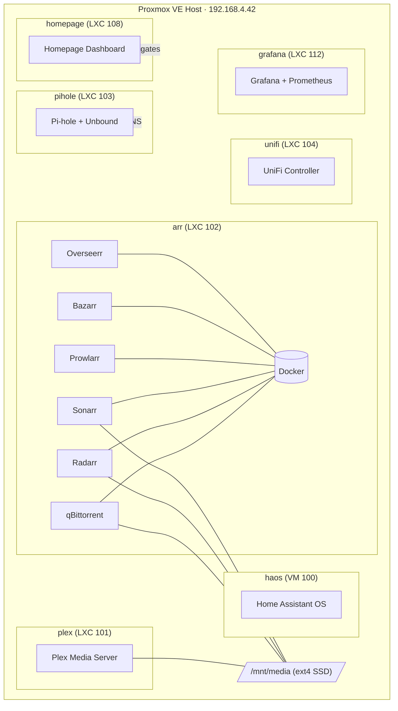

# HomeServarr

> A self-hosted home lab built on Proxmox VE — media streaming, network management, home automation, and AI-assisted operations, all on a single bare-metal host.

---

## Architecture



**Design principles**

- **Unprivileged LXCs** for all services — Docker runs only where needed (LXC 102)
- **Pi-hole + Unbound** for local DNS with no upstream dependency
- **Nabu Casa** for secure remote HA access — no port forwarding or VPN required
- **Twingate** for zero-trust remote access to everything else
- **Jarvis** (Claude Code agent) for AI-assisted lab operations directly from VS Code

---

## Services

| VMID | Host | Role | Local Address | Access |
|------|------|------|---------------|--------|
| 100 | `haos` | Home Assistant OS | `homeassistant.home` · `192.168.4.136` | Nabu Casa (remote) |
| 101 | `plex` | Plex Media Server | `plex.home:32400` | Local + Plex relay |
| 102 | `arr` | *arr* stack (Docker) | `arr.home` | Local |
| 103 | `pihole` | DNS + ad-blocking | `pihole.home` · `192.168.4.53` | Local |
| 104 | `unifi` | UniFi network controller | `unifi.home:8443` | Local |
| 105 | `n8n` | Workflow automation | `n8n.home` | Local |
| 106 | `twingate` | Zero-trust connector | — | Remote |
| 108 | `homepage` | Dashboard | `homepage.home` | Local |
| 109 | `teamspeak` | TeamSpeak voice server | — | Remote |
| 111 | `homebridge` | Apple HomeKit bridge | `homebridge.home` | Local |
| 112 | `grafana` | Metrics & dashboards | `grafana.home:3000` | Local |

### *arr* Stack — LXC 102 (Docker)

| Service | Port | Purpose |
|---------|------|---------|
| qBittorrent | 8080 | Download client |
| Radarr | 7878 | Movie management |
| Sonarr | 8989 | TV management |
| Prowlarr | 9696 | Indexer aggregation |
| Bazarr | 6767 | Subtitle management |
| Overseerr | 5055 | User request portal |

All services share `/mnt/media` via a bind mount from the Proxmox host SSD.

---

## Home Assistant & Tesla Fleet

HA OS runs as VM 100 and is the hub for all home automation. Remote access is handled by Nabu Casa — no port forwarding or dynamic DNS needed.

### Tesla Model 3 — *Tessie*

Connected via the native HA `tesla_fleet` integration (VIN `LRW3F7EK8NC684538`) with **88 entities** across battery, charging, climate, locks, windows, doors, seat heaters, location, and media.

**Working today**

| Entity | What it does |
|--------|-------------|
| `sensor.tessie_battery_level` | State of charge |
| `sensor.tessie_charging` | Charging state (complete / charging / stopped) |
| `switch.tessie_charge` | Start / stop charging |
| `number.tessie_charge_limit` | Set charge limit (50–100%) |
| `device_tracker.tessie_location` | Live GPS location |
| `climate.tessie_climate` | HVAC (read-only until virtual key paired) |
| `lock.tessie_lock` | Door lock (read-only until virtual key paired) |

**Public key hosting**

Tesla Fleet API requires a public key at `/.well-known/appspecific/com.tesla.3p.public-key.pem`. HA has no built-in mechanism for serving files at arbitrary HTTP paths, so this repo includes a minimal custom component (`homeassistant/custom_components/tesla_public_key/`) that registers an unauthenticated aiohttp view directly on HA's HTTP server. Nabu Casa transparently proxies all requests, so the key is reachable at the Nabu Casa subdomain without any additional configuration.

**⚠️ TODO — Virtual key (NFC pairing)**

Sensor data and charging control work without it. Everything else — climate pre-conditioning, locking/unlocking, frunk, trunk, windows — requires a virtual key paired to the car. Requires physical proximity to *Tessie*.

1. In HA: **Settings → Devices & Services → Tesla Fleet → Configure → Add key to vehicle**
2. Open the generated link in the **Tesla mobile app**
3. Tap your phone to the car's **NFC reader** (center console) to complete pairing

Full setup reference → [`docs/home-assistant.md`](docs/home-assistant.md)

---

## Jarvis — AI Lab Assistant

This repo is also the configuration source for **Jarvis**, a Claude Code agent specialised for home lab operations. Skills are defined in `skills/` and invoked from VS Code or `scripts/jarvis_chat.sh`.

| Skill | What it does |
|-------|-------------|
| `container-patching` | Bulk security updates across all LXCs |
| `health-monitoring` | System health reports with pass/fail summary |
| `dns-management` | Pi-hole custom DNS record management |
| `media-disk-management` | Disk usage monitoring and intelligent auto-prune |
| `host-maintenance` | Proxmox host patching with kernel management |
| `service-discovery` | LXC inventory and network map |

Example prompts:
```
"Jarvis, generate a health report"
"Check media disk — prune if over 90%"
"Patch all LXC containers"
"Add a DNS record for my new service"
```

---

## Operations

### Automated Patching

`scripts/patch_all_containers.sh` runs weekly (Sundays 02:00) via cron on the Proxmox host. It iterates every LXC with `pct list`, runs `apt-get update && upgrade` inside each, logs failures without stopping, and writes a summary that Homepage can display.

The Proxmox host itself is patched monthly via `scripts/patch_pve_host.sh`.

### Media Disk Management

`scripts/media_prune_and_alert.sh` monitors `/mnt/media` and acts on thresholds:

| Usage | Action |
|-------|--------|
| > 85% | Warning notification via ntfy |
| > 90% | Critical alert + auto-prune: Sonarr seasons older than 60 days (ended series), Radarr unmonitored movies older than 120 days |

### Monitoring

Grafana (`grafana.home:3000`) pulls from Prometheus and Node Exporter running on the PVE host. Import dashboard **ID 1860** (Node Exporter Full) for CPU, memory, disk I/O, and network throughput. Add **ID 10048** (Proxmox via pve-exporter) for VM and container metrics.

---

## Troubleshooting

**Unprivileged LXC fails to start — `Operation not permitted` on `/etc/resolv.conf`**

Immutable flag set on the host. Fix:
```bash
pct mount <vmid>
chattr -i /var/lib/lxc/<vmid>/rootfs/etc/resolv.conf
pct unmount <vmid>
```

**Docker AppArmor profile error inside an unprivileged LXC**

Add to the LXC's config in `/etc/pve/lxc/<vmid>.conf`:
```ini
lxc.apparmor.profile: unconfined
```

**Disk space not freed after deleting files**

A process still holds the file open. Find it:
```bash
lsof | grep /mnt/media | grep deleted
```

**HA Tesla commands return "key not set up"**

The virtual key has not been NFC-paired to the car. Follow the pairing steps in [`docs/home-assistant.md`](docs/home-assistant.md).

---

## Docs

| Document | Contents |
|----------|----------|
| [`docs/home-assistant.md`](docs/home-assistant.md) | Tesla Fleet integration, custom public key component, virtual key pairing |
| [`docs/hardware.md`](docs/hardware.md) | Host hardware specs and resource guidance |
| [`docs/network_plan.md`](docs/network_plan.md) | Subnet layout and DNS architecture |
| [`docs/architecture.html`](docs/architecture.html) | Interactive service map |

---

## Roadmap

- [ ] **NFC virtual key pairing** for Tessie — unlocks climate, locks, frunk/trunk, windows
- [ ] pve-exporter → Prometheus for per-VM/CT Grafana metrics (dashboard ID 10048)
- [ ] Grafana alerting for high CPU/RAM with ntfy notification channel
- [ ] Loki for Pi-hole + Docker log aggregation in Grafana
- [ ] Backup strategy: Proxmox snapshots + restic/rclone offsite for `/opt`, `/mnt/media`
- [ ] First-class docs for n8n, Homebridge, and Immich

---

*Proxmox VE 9 · Debian 12 host · Ubuntu 24.04 LXCs · Last updated May 2026*
