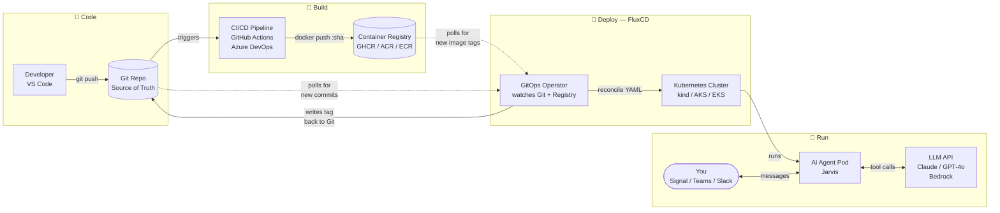
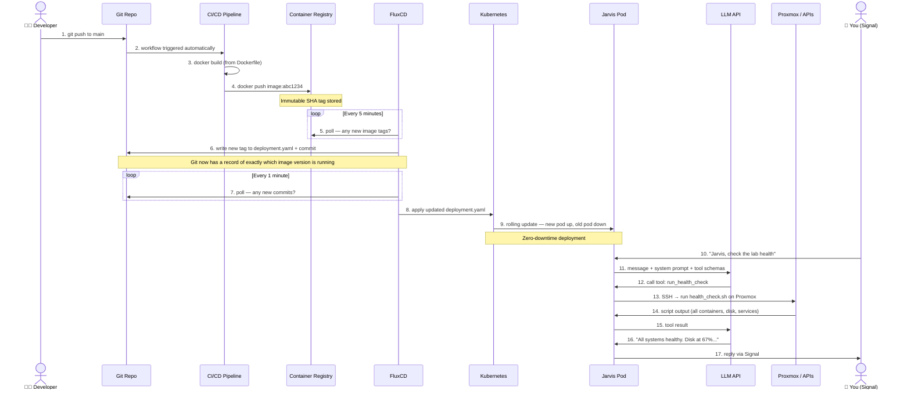
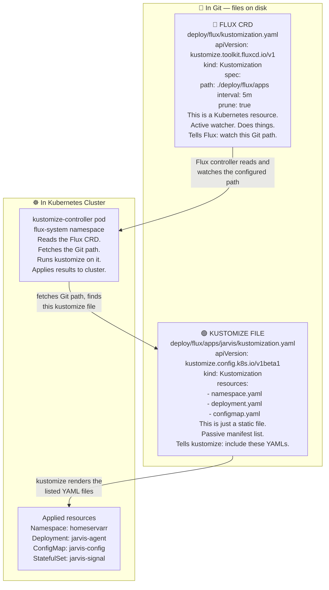
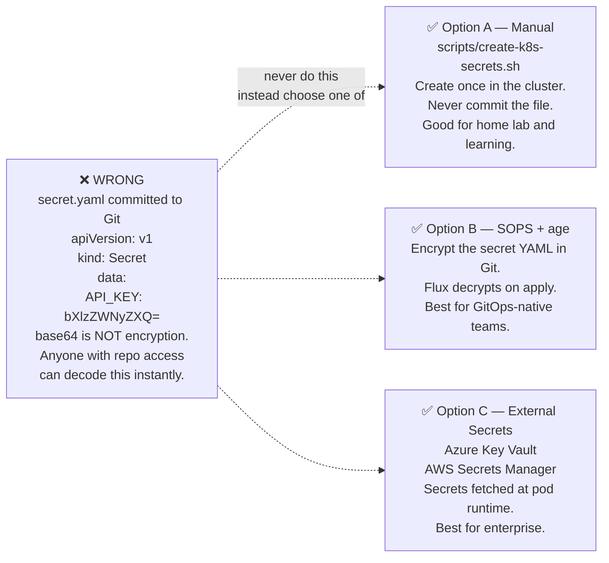
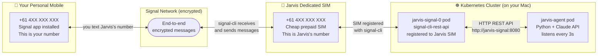

# Enterprise GitOps & AI Agent Deployment — Cheat Sheet

> **Who this is for:** Engineers who are comfortable with VS Code and have learnt GitOps basics (repos, branches, commits). You may have worked with `brain.md` and `soul.md` style agent files. This cheat sheet maps what we built in the HomeServarr home lab to enterprise equivalents across Azure, AWS, and any cloud.

---

## 1 — The Big Picture (30 seconds)

Imagine a factory floor — here is the whole system at a glance:



- The **Git repository** is the blueprint room. Every change starts here.
- The **CI/CD pipeline** (GitHub Actions / Azure DevOps) is the assembly line. It takes your code and packages it into a container image.
- The **container registry** (GHCR / Azure Container Registry) is the warehouse where finished containers are stored.
- The **Kubernetes cluster** (kind / AKS / EKS) is the factory floor — it runs your containers.
- **FluxCD** is the foreman. It watches the blueprint room (Git) and makes sure the factory floor always matches the latest blueprints.
- The **AI agent** (Jarvis / your enterprise bot) is a worker on the floor. It reads a job description (`brain.md` / system prompt) and uses tools to get work done.
- The **messaging platform** (Signal / Teams / Slack) is the intercom — how humans give the AI worker instructions.

**The golden rule of GitOps:** Git is the only way to make changes. You never SSH into a server or click buttons in a portal to deploy. If it's not in Git, it doesn't exist.

---

## 2 — Technology Mapping Table

| What it does | Home Lab (what we built) | Azure | AWS | Generic term |
|---|---|---|---|---|
| Run containers at scale | `kind` (Docker on Mac) | **Azure Kubernetes Service (AKS)** | Elastic Kubernetes Service (EKS) | Managed Kubernetes |
| Store container images | GitHub Container Registry (GHCR) | **Azure Container Registry (ACR)** | Elastic Container Registry (ECR) | Container registry |
| Build & push images on code push | GitHub Actions | **Azure DevOps Pipelines** | AWS CodePipeline / GitHub Actions | CI/CD pipeline |
| GitOps operator (watch Git → apply to cluster) | **FluxCD** | FluxCD or ArgoCD on AKS | FluxCD or ArgoCD on EKS | GitOps operator |
| AI language model (the "brain") | Claude API (Anthropic) | **Azure OpenAI (GPT-4o)** | AWS Bedrock (Claude / Titan) | LLM API |
| Store secrets safely | Kubernetes Secrets (manual) | **Azure Key Vault** | AWS Secrets Manager | Secrets vault |
| Encrypt secrets in Git | SOPS + age key | **SOPS + Azure Key Vault** | SOPS + AWS KMS | Secrets-in-Git encryption |
| Chat interface to the agent | Signal (mobile app) | **Microsoft Teams** | Slack / Teams | Messaging platform |
| Infrastructure automation target | Proxmox (SSH) | **Azure Resource Manager APIs** | AWS SDK / SSM | Infrastructure APIs |
| Agent persona / instructions | `.agent.md` / `brain.md` | System prompt in Azure AI Studio | System prompt in Bedrock | System prompt |
| Agent capabilities / skills | `SKILL.md` / `soul.md` | Tool definitions in Azure AI Foundry | Tool schemas in Bedrock Agents | Tool manifest |
| Observe what the system is doing | kubectl logs / Grafana | **Azure Monitor + Log Analytics** | CloudWatch | Observability stack |

---

## 3 — The 7 Building Blocks (one paragraph each)

### Block 1: The Git Repository — "The Source of Truth"

Everything lives here. Your application code, your Kubernetes YAML files, your agent instructions, your pipeline definitions. When someone wants to make a change — to the app, to the infrastructure, to the AI agent's behaviour — they open a pull request. That PR is reviewed, approved, and merged. Only then does anything actually change. This means every change is reviewed, reversible, and auditable. In Azure shops this is typically **Azure Repos** (inside Azure DevOps) or **GitHub** (which Microsoft owns).

### Block 2: The CI/CD Pipeline — "The Assembly Line"

When code merges to `main`, the pipeline wakes up automatically. In our home lab that is **GitHub Actions** (`.github/workflows/docker-build.yml`). In enterprise it is **Azure DevOps Pipelines** or GitHub Actions (same product, enterprise tier). The pipeline does three things: (1) runs tests, (2) builds a container image, (3) pushes it to the container registry with a unique tag (usually the Git commit SHA). The pipeline never touches the cluster directly — it just produces a container image. Separating "build" from "deploy" is critical: it means you can build on any machine and deploy anywhere.

### Block 3: The Container Registry — "The Warehouse"

A container image is a zip file of your application and all its dependencies. The registry stores these images, versioned by tag. In our setup it is **GitHub Container Registry (GHCR)** at `ghcr.io/majorrabbid/homeservarr-jarvis-agent`. In Azure: **Azure Container Registry (ACR)** at `yourorg.azurecr.io/jarvis-agent`. AWS: **ECR** at `123456789.dkr.ecr.ap-southeast-2.amazonaws.com/jarvis-agent`. The tag is usually:
- `:latest` — always the newest (avoid in production — you lose traceability)
- `:abc1234` — the 7-character Git commit SHA. This is immutable. You always know exactly which code version is running.

### Block 4: The Kubernetes Cluster — "The Factory Floor"

Kubernetes (K8s) is the system that runs your containers. You tell it "I want 2 copies of this container, restart it if it crashes, give it this much CPU and RAM" and it makes it happen. In our home lab we run `kind` (Kubernetes-in-Docker) on a Mac. In production:
- **Azure**: AKS (Azure Kubernetes Service) — managed control plane, you pay for the worker nodes
- **AWS**: EKS (Elastic Kubernetes Service) — same concept
- **On-prem**: k3s (lightweight, perfect for home labs, also used in enterprise edge deployments)

Key Kubernetes concepts you'll encounter:
- **Pod**: one running container (or a group of tightly coupled containers)
- **Deployment**: manages N identical pods, handles rolling updates
- **StatefulSet**: like a Deployment but pods have stable identities and their own persistent disk (used for Signal CLI — it needs to remember its registered number)
- **Service**: a stable DNS name + IP address for reaching a set of pods (Kubernetes internal load balancer)
- **Namespace**: a virtual partition inside the cluster — like a folder. Our app is in the `homeservarr` namespace.
- **ConfigMap**: non-sensitive configuration variables injected into pods as environment variables
- **Secret**: sensitive variables (API keys, passwords) — base64 encoded, access-controlled

### Block 5: FluxCD — "The GitOps Foreman"

FluxCD runs *inside* the Kubernetes cluster. It watches your Git repository every 1-5 minutes. When it sees a new commit, it pulls the YAML files from the configured paths and applies them to the cluster. If someone manually changes the cluster (e.g., directly runs `kubectl` to change a deployment), Flux corrects it back to what Git says within minutes. This "drift correction" is what makes GitOps self-healing.

Flux has four components running as pods in the `flux-system` namespace:
- **source-controller**: watches Git, stores snapshots of the repo
- **kustomize-controller**: reads YAML files from snapshots, applies them
- **helm-controller**: deploys Helm charts (pre-packaged Kubernetes apps)
- **notification-controller**: sends alerts (Slack, Teams, etc.) when reconciliation fails

Two additional optional components we added:
- **image-reflector-controller**: watches the container registry for new image tags
- **image-automation-controller**: writes the new tag into `deployment.yaml` and commits to Git

### Block 6: The AI Agent — "The Worker"

The agent is a Python application that runs in a pod. It does three things in a loop:
1. **Listen** — polls the messaging platform (Signal / Teams) for new messages from authorised users
2. **Think** — sends the message to the LLM API (Claude / GPT-4o / Bedrock Claude) with a system prompt and available tools
3. **Act** — if the LLM decides to use a tool (run a health check, request a movie, patch servers), it executes the tool and sends the result back to the LLM for a final response, then replies to the user

This is called an **agentic loop** — the model reasons, calls tools, reasons again, and repeats until it has an answer. The key files are:
- `jarvis.py` — the polling loop and message dispatcher
- `agent.py` — the Claude API agentic loop (handles tool use)
- `tools.py` — the actual tool implementations (SSH, Overseerr API, etc.)

### Block 7: The Brain & Soul — "The Agent's Instructions"

This is where your team's `brain.md` / `soul.md` experience applies directly.

| File in this repo | What it is | Enterprise equivalent |
|---|---|---|
| `.github/agents/.agent.md` | Jarvis's overall persona, scope, what it knows about the home lab | **System prompt** in Azure AI Foundry / Bedrock |
| `skills/chat/SKILL.md` | How to handle conversational requests | **Tool description** — the docstring the LLM reads to decide when to use a capability |
| `skills/health-monitoring/SKILL.md` | How to run health checks | Another tool description / sub-agent definition |
| `deploy/flux/apps/jarvis/configmap.yaml` | Non-sensitive runtime config | **App Configuration** (Azure) / Parameter Store (AWS) |

In Azure AI Foundry you define:
- **System prompt** = the brain — who the agent is, what it knows, what rules it follows
- **Tool definitions** = the soul — what the agent can DO, as structured JSON schemas
- **Retrieval (RAG)** = long-term memory — connecting the agent to Azure AI Search or a vector DB

In AWS Bedrock Agents:
- **System prompt** = same concept
- **Action groups** = equivalent to tools — Lambda functions the agent can invoke
- **Knowledge bases** = retrieval / RAG via OpenSearch Serverless

---

## 4 — How It All Connects: The Full GitOps Loop



---

## 5 — The Two `kustomization.yaml` Files (the thing that confuses everyone)

There are two completely different things both called `Kustomization`. This trips up almost every engineer learning Flux for the first time.



**The analogy:** The kustomize file is like `package.json` — a static list of what to include. The Flux Kustomization is like a running GitHub Action — an active process that does something continuously.

---

## 6 — Secrets: The Thing You Cannot Put in Git



**SOPS** (Secrets OPerationS) is the most popular GitOps-native option:
1. Generate an **age** keypair — the private key lives only on the cluster as a Kubernetes Secret
2. Encrypt your secret YAML file: `sops --encrypt --age <pubkey> secret.yaml > secret.enc.yaml`
3. Commit the `.enc.yaml` — it's safe in Git because it's encrypted
4. Flux decrypts it automatically during apply using the cluster's private key
5. Result: secrets are in Git (encrypted), no manual `kubectl create secret` needed after setup

---

## 7 — Signal → Enterprise Messaging Mapping

The home lab uses Signal as the interface because it's end-to-end encrypted, free, and works from any phone. In enterprise you replace Signal with your corporate chat platform. The agent code changes minimally — just swap the `signal_client.py` for a Teams/Slack adapter.

| Platform | How the agent receives messages | How the agent sends replies |
|---|---|---|
| **Signal** (home lab) | Poll `signal-cli-rest-api` every 3s | POST to signal-cli REST API |
| **Microsoft Teams** | Incoming webhook or Bot Framework | Outgoing webhook via Bot Framework |
| **Slack** | Events API (webhook push) | Slack Web API `chat.postMessage` |
| **WhatsApp Business** | Meta Cloud API webhook | Meta Cloud API |

For Teams in Azure: use **Azure Bot Service** + **Bot Framework SDK**. The bot registers with Teams, receives messages as HTTP webhooks, passes them to your agent loop, replies via the Bot Framework API. The agent logic (LLM call + tool use) is identical — only the messaging adapter changes.

---

## 8 — LLM API: Cloud Agnostic

The agent's `agent.py` calls `anthropic.AsyncAnthropic()`. To switch providers, you change this one file. The tool schema format is standardised across providers (OpenAI function calling format is the de facto standard).

```python
# What we have (Anthropic / Claude)
client = anthropic.AsyncAnthropic(api_key=ANTHROPIC_API_KEY)

# Azure OpenAI drop-in
from openai import AsyncAzureOpenAI
client = AsyncAzureOpenAI(
    azure_endpoint="https://yourorg.openai.azure.com",
    api_key=AZURE_OPENAI_KEY,
    api_version="2024-02-01"
)

# AWS Bedrock (boto3)
import boto3
client = boto3.client("bedrock-runtime", region_name="ap-southeast-2")
# Call: client.converse(modelId="anthropic.claude-3-5-sonnet-20241022-v2:0", ...)
```

All three support **tool use / function calling** — the mechanism that lets the LLM say "I need to call the `run_health_check` tool" and your code executes it. The JSON schema for tools is nearly identical across providers.

---

## 9 — Enterprise Kubernetes Concepts Your Team Needs

| Concept | What it is | When you see it |
|---|---|---|
| **Pod** | One running instance of a container | `kubectl get pods -n homeservarr` |
| **ReplicaSet** | Ensures N identical pods are always running | Managed by Deployment automatically |
| **Deployment** | Describes the desired state (image, replicas, env) | `deploy/flux/apps/jarvis/deployment.yaml` |
| **StatefulSet** | Deployment for stateful apps — stable hostname + own PVC | `deploy/flux/apps/signal/statefulset.yaml` |
| **Service** | DNS name that routes traffic to pods | `http://jarvis-signal:8080` inside the cluster |
| **ConfigMap** | Non-secret key-value config injected as env vars | `deploy/flux/apps/jarvis/configmap.yaml` |
| **Secret** | Sensitive config — base64 encoded, access controlled | `scripts/create-k8s-secrets.sh` |
| **PVC** (Persistent Volume Claim) | "I need X GB of disk, please" — storage request | Signal CLI needs this to persist account data |
| **Namespace** | Virtual partition — like a project folder in the cluster | `homeservarr`, `flux-system` |
| **Ingress** | HTTP routing — maps `jarvis.mycompany.com` to a Service | Not needed for a bot, but needed for web UIs |
| **RBAC** | Who is allowed to do what in the cluster | Flux uses a ServiceAccount with cluster-admin |
| **HPA** | Horizontal Pod Autoscaler — scales pods up/down on load | Used in production for stateless APIs |

---

## 10 — VS Code Integration: Your Day-to-Day Workflow

```
VS Code (your workstation)
├── Explorer sidebar
│   └── HomeServarr repo
│       ├── .github/agents/.agent.md   ← Edit agent persona here (brain)
│       ├── skills/*/SKILL.md          ← Edit tool descriptions here (soul)
│       ├── docker/agent/
│       │   ├── jarvis.py              ← Agent polling loop
│       │   ├── agent.py               ← LLM agentic loop
│       │   └── tools.py              ← Tool implementations (SSH, APIs)
│       └── deploy/flux/apps/
│           ├── jarvis/deployment.yaml ← K8s deployment spec
│           └── signal/statefulset.yaml
│
├── Source Control (Git icon in sidebar)
│   └── Stage → Commit → Push
│       └── triggers GitHub Actions → builds image → Flux reconciles
│
├── Terminal (Ctrl+`)
│   ├── kubectl get pods -n homeservarr       ← see what's running
│   ├── kubectl logs -n homeservarr -l app=homeservarr-jarvis-agent -f  ← live logs
│   ├── flux get all                           ← see all Flux resources
│   └── flux reconcile kustomization homeservarr-agent  ← force sync now
│
└── Extensions useful for this stack
    ├── Kubernetes (Microsoft) — browse cluster resources in sidebar
    ├── GitLens — see who changed what and when
    ├── YAML (Red Hat) — schema validation for K8s YAML
    └── Docker — manage images and containers
```

---

## 11 — Glossary for Absolute Beginners

| Term | Plain English |
|---|---|
| **Container** | A self-contained box with your app + everything it needs to run. Works the same on your laptop, in CI, and in production. |
| **Container image** | A snapshot (zip file) of a container. Stored in a registry. Tagged with a version. |
| **Kubernetes** | A system that runs your containers, restarts them if they crash, and spreads them across machines. |
| **GitOps** | A way of working where Git is the only way to change infrastructure. No manual clicking in portals. |
| **FluxCD** | The GitOps engine. It watches Git and makes the cluster match what's in Git. |
| **Helm** | A package manager for Kubernetes, like `apt` or `npm`. Pre-packaged apps (called Charts) that you configure. |
| **Namespace** | A folder inside the cluster. Different teams use different namespaces. |
| **Reconcile** | Flux comparing what's in Git to what's in the cluster and making them match. |
| **LLM** | Large Language Model — the AI "brain" (GPT-4, Claude, etc.). Takes text in, produces text out. |
| **Tool use / Function calling** | The ability for an LLM to say "I need to run a command" and your code executes it, then feeds the result back to the LLM. |
| **Agentic loop** | The LLM thinks → calls a tool → gets the result → thinks again → calls another tool (or answers). Repeats until done. |
| **System prompt** | The instructions you give the LLM before the conversation starts — the "brain". Defines its persona, rules, and available tools. |
| **E.164** | The international phone number format: `+` then country code then number with no spaces. Australia: `+61412345678`. |
| **PVC** | Persistent Volume Claim — a request for disk storage in Kubernetes. The cluster fulfils it. |
| **CI/CD** | Continuous Integration / Continuous Delivery. Automated pipeline: test → build → deploy. |
| **Drift** | When the cluster's actual state no longer matches what Git says. Flux detects and corrects it. |
| **SHA tag** | A container image tag based on the Git commit hash (e.g. `:abc1234`). Immutable — always means the same code. |
| **SOPS** | Secrets OPerationS — a tool for encrypting secrets before committing to Git. Flux decrypts on apply. |
| **Kustomize** | A tool for customising Kubernetes YAML — like templates but without a templating language. |

---

## 12 — Australian Signal Setup Reference



**Australian number format:**
```
Local format:    0412 345 678
E.164 format:   +61412345678
                 ^^            country code (61 = Australia)
                   ^           drop the leading 0 from the local number
                    ^^^^^^^^^  rest of the mobile number
```

**Registration commands (run once):**
```bash
# 1. Register Jarvis's SIM number with Signal.
#    Signal sends an SMS to the physical SIM card.
kubectl exec -n homeservarr jarvis-signal-0 -- \
  curl -X POST 'http://localhost:8080/v1/register/+61412345678'

# 2. Read the SMS code from the Jarvis SIM, then verify:
kubectl exec -n homeservarr jarvis-signal-0 -- \
  curl -X POST 'http://localhost:8080/v1/register/+61412345678/verify/123456'

# 3. Confirm registration:
kubectl exec -n homeservarr jarvis-signal-0 -- \
  curl -s 'http://localhost:8080/v1/accounts' | python3 -m json.tool
```

**Then text Jarvis from your personal Signal app:**
- Open Signal → New Chat → enter the Jarvis SIM number
- Type: "Jarvis, how's the home lab?"
- Reply arrives within 3-10 seconds

---

*Last updated: May 2026 · HomeServarr home lab · FluxCD v2.8.8 · Kubernetes 1.35*
